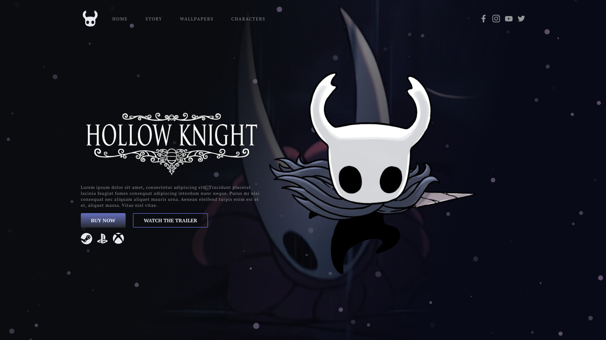

  

# Frontweek: Hollow Knight

Projeto feito inspirado nas aulas da Frontweek (2021), do Násser Yousef Ali

| :placard: Vitrine.Dev |     |
| -------------  | --- |
| :sparkles: Nome        | **Frontweek: Hollow Knight**
| :label: Tecnologias | HTML, CSS, SASS, Javascript, JQuery, Figma
| :rocket: URL         | https://frontweek-hollowknight.netlify.app/
| :fire: Desafio     | https://nasseryousef.com.br/spidermanpeter/

## Preview

## Detalhes do projeto

### Tecnologias e ferramentas

- HTML5
  - Usado para a estruturar o site

- Sass e CSS
  - Usado para a estilização do layout da página, menu, responsividade e para deixar mais fácil a codificação do CSS

- Javascript e JQuery
  - Usado para gerenciar as libs utilizadas no projeto

- Figma
  - Utilizado para montar o UI design e para produzir o SVG usado como logo

- [SVG Inject](https://github.com/iconfu/svg-inject)
  - Utilizado para facilitar o uso de SVG's na página e deixar o código mais limpo

- [Tilt.js](https://gijsroge.github.io/tilt.js/)
  - Utilizado para aplicar o efeito de perspectiva ao passar o mouse na imagem principal

- [TweenMax](https://greensock.com/docs/v2/TweenMax)
  - Utilizado para montar a timeline de animações

- [Particles.js](https://github.com/VincentGarreau/particles.js/)
  - Utilizado para aplicar o efeito de partículas

<!--

  

 ### Acesse [aqui](https://frontweek-hollowknight.netlify.app/)
 -->
